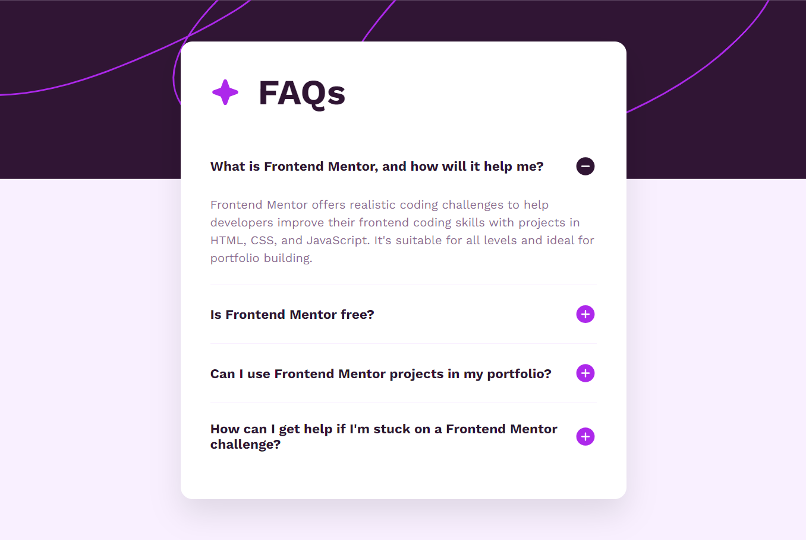

# Frontend Mentor - FAQ accordion solution

This is a solution to the [FAQ accordion challenge on Frontend Mentor](https://www.frontendmentor.io/challenges/faq-accordion-wyfF9vD7oH).

## Table of contents

- [Overview](#overview)
  - [The challenge](#the-challenge)
  - [Screenshot](#screenshot)
  - [Links](#links)
- [My process](#my-process)
  - [Built with](#built-with)
  - [What I learned](#what-learned)
- [Author](#author)

## Overview

### The challenge

Users should be able to:

- Hide/Show the answer to a question when the question is clicked.
- Navigate the accordion and hide/show answers utilizing keyboard navigation.
- View the optimal layout for the interface depending on their device's screen size.
- See hover and focus states for all interactive elements on the page.

### Screenshot



### Links

- Solution URL: https://github.com/PatoCatejo/faq-accordion
- Live Site URL: https://patocatejo.github.io/faq-accordion/

## My process

### Built with

- Semantic HTML5 markup (Details & Summary tags)
- CSS Custom properties
- Flexbox
- Mobile-first workflow
- Vanilla JavaScript for accordion logic

### What I learned

In this project, I prioritized semantic HTML by using the `<details>` and `<summary>` elements. This allowed me to create an accessible accordion that works natively with keyboard navigation and screen readers without heavy JavaScript.

I also implemented a "Single Open" logic in JavaScript to ensure that only one FAQ item remains open at a time, providing a cleaner user experience.

```javascript
const details = document.querySelectorAll(".faq-item");

details.forEach((targetDetail) => {
  targetDetail.addEventListener("click", () => {
    details.forEach((detail) => {
      if (detail !== targetDetail) {
        detail.removeAttribute("open");
      }
    });
  });
});
```

## Author

👤 **Patricio Catejo**
